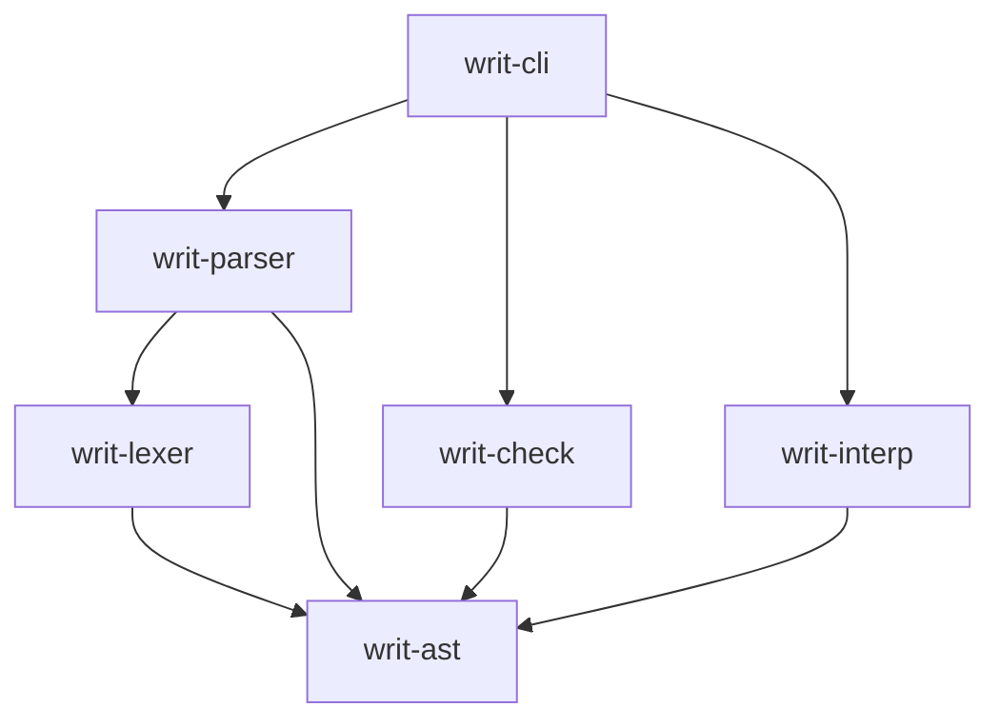

# Writ

Writ is a general-purpose programming language whose **primary author is an LLM**. It is implemented in **Rust**. Everything in this repo exists to serve one goal:

> **Prime directive:** subtle wrongness should become a *compile error*, and dangerous power should be *unreachable by default*. When those two properties are in tension with brevity, cleverness, or convenience, they win.

Use this directive to break ties. A change that makes generated code easier to write but easier to get silently wrong is the wrong change.

---

## Commands

Run these from the repo root. The three-check **gate** below is exactly what CI runs and what any change must pass before a PR.

```bash
# Gate (run all three before opening a PR)
cargo fmt --check
cargo clippy --all-targets -- -D warnings
cargo test --all

# Everyday
cargo build
cargo fmt                       # auto-format
cargo test -p writ-parser       # test one crate
cargo run -p writ-cli -- check  path/to/file.writ   # run checkers only
cargo run -p writ-cli -- run    path/to/file.writ   # interpret
cargo run -p writ-cli -- build  path/to/file.writ   # compile (once codegen exists)
```

If a command doesn't exist yet, the crate that should own it probably isn't built — check the issue tracker before inventing a new home for it.

---

## Architecture

Pipeline: **source → lexer → parser → AST → checkers → interpreter** (native codegen comes later; self-hosting later still).

Crates and their **allowed dependency direction** (arrows = "depends on"):



- **`writ-ast`** — the shared, standalone data type for the whole compiler, plus the `Span` and `Diagnostic` types. Depends on nothing heavy. This is the contract every other crate agrees on.
- **`writ-lexer`** — text → tokens. Carries spans.
- **`writ-parser`** — tokens → AST. Includes signature parsing for `uses {...}`, `requires`, `ensures`.
- **`writ-check`** — all static analysis: type checker, effect system, capability authority checker, contract checker. Depends on the AST, **never on the interpreter**.
- **`writ-interp`** — a tree-walking evaluator over the AST. A back end, not the source of truth.
- **`writ-cli`** — a *thin* driver. Wiring only; no language logic lives here.

**Invariants — a change that breaks one of these is wrong, not clever:**
- The graph is **acyclic**. Nothing depends on `writ-interp` or `writ-cli`.
- The **front end is written once**. The AST must serve both the interpreter and the future compiler; adding a back end must not force front-end changes.
- **Checkers never import the interpreter**, and the interpreter never does static analysis.

---

## The two pillars (read before touching `writ-check`)

Writ's safety rests on two **orthogonal** checkers. They are independent passes that do not reference each other; either can be disabled without breaking the other. Keep them that way.

### Capabilities — *authority* ("what may this code do?")
- **No ambient authority.** An effect (file write, network, spawning a process) is reachable only if an **unforgeable capability token** was passed into the function as a parameter.
- Capability values are **un-constructible in user code** and **parameter-only**. A function with no capability parameter is sandboxed *by construction*, not by convention. If you can find a way for user code to conjure a capability, that is a security bug.
- Signatures declare effects with `uses {...}`. At every **effect site** the checker enforces two things: the caller **holds** the capability (authority) and the signature **declared** the effect (honesty).
- Untrusted data is `Tainted<T>` and cannot reach a **sink** (shell, query) without passing a `sanitize` boundary.

### Contracts — *correctness* ("is the answer right?")
- `requires` (preconditions) and `ensures` (postconditions) attach to a signature.
- Enforced at runtime per input, and — where feasible — proven statically for all inputs via SMT.
- **Blame direction is load-bearing:** a failed precondition blames the **caller**; a failed postcondition blames the **implementation**. Preserve this in diagnostics — it's the signal a generate-check-repair loop relies on.

Capabilities never speak about correctness; contracts never speak about authority. If a change makes one reference the other, stop and reconsider.

---

## Language design principles to preserve

- **Strong static types, no implicit coercion, non-null by default**, exhaustive `match`. Turn "plausible but wrong" into "doesn't compile."
- **Effects live in the type system** — a signature tells you what a function can do.
- **Locality / no spooky action at a distance:** immutability by default, **no global mutable state** (no `static mut`, global registries, or hidden singletons), no surprising control flow. A model editing one function must not be able to silently break a distant one. Global state is especially damaging because it destroys the local-reasoning property the whole language exists to provide.
- **Errors are an API for the model** — see below.

---

## Testing rules

- **Test-first.** Write the failing test that encodes the acceptance criteria before the implementation.
- **Negative tests are mandatory for safety features.** For anything touching capabilities, contracts, or effects, a passing test is not enough — include a test proving that code which *should be refused* is refused, with the right diagnostic. The rejection is the feature.
- **Golden/snapshot tests** for the lexer and parser.
- **Determinism:** tests and builds must be reproducible. Fence off any nondeterminism; never write a test that depends on ordering, timing, or environment.

---

## Errors are an API

Diagnostics are consumed by models, not just humans. So:
- Use the **single shared `Diagnostic` type** from `writ-ast`. Do not invent ad-hoc error strings per pass.
- Every diagnostic carries a stable **code**, a **span**, and a **message**, and is **serializable**.
- Output is **deterministic** — same input, same diagnostics, same order.
- Messages are precise and actionable. Prefer "expected `Int`, found `Text` at <span>" over "type error".

---

## Git & workflow

- **Issues drive the work.** Pick up work through the tracker (see `/autowork`). Priority order: `priority:p0` > `p1` > `p2`, then milestone `M0` … `M8`.
- **One issue per branch per PR.** Branch names: `feat/<n>-<slug>`, `fix/<n>-<slug>`, `chore/…`, `docs/…`.
- **Conventional commits:** `feat(lexer): add byte spans to tokens`. Small, logical commits.
- **PRs** state what changed, why, how it was verified, the acceptance criteria as a ticked checklist, and `Closes #<n>`.
- **Stay in scope.** Tempting adjacent work becomes a **new issue**, never scope creep in the current PR.

---

## Guardrails — never do

- **Never merge PRs, never push to `main`, never force-push.** The human's control point is the merge; keep it intact.
- Never rewrite or delete someone else's work; never `git stash`/discard a dirty tree to make room.
- Never weaken a check to make a build pass (no removing a `-D warnings`, no `#[allow]` to silence a real lint, no deleting a failing test).
- Never introduce ambient authority or global mutable state.
- When genuinely blocked — ambiguous spec, unmet dependency, a decision only a human should make — **stop and ask on the issue** with a specific question. Prefer stopping over shipping something wrong.

---

## Glossary (use these terms consistently)

- **Authority** — what code is *permitted* to do (governed by capabilities).
- **Correctness** — whether code returns the *right* result (governed by contracts).
- **Capability** — an unforgeable token granting one specific effect; parameter-only.
- **Effect site** — a point in code that performs an effect (I/O, etc.).
- **Sink** — a dangerous destination for data (shell, query); reachable only by sanitized values.
- **Honesty check** — verifying a body's effects are all declared in its `uses {...}`.
- **Ambient authority** — the (forbidden) ability to cause effects without being handed a capability.

---

## Where to look

- Language spec and design notes: `/docs`.
- Roadmap and current work: GitHub issues and milestones `M0`–`M8`.
- When something here conflicts with a specific issue's acceptance criteria, the issue wins for that task — but flag the conflict so this file can be corrected.